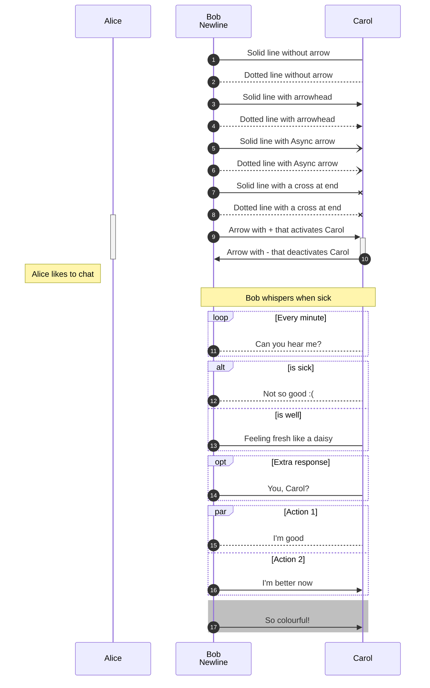
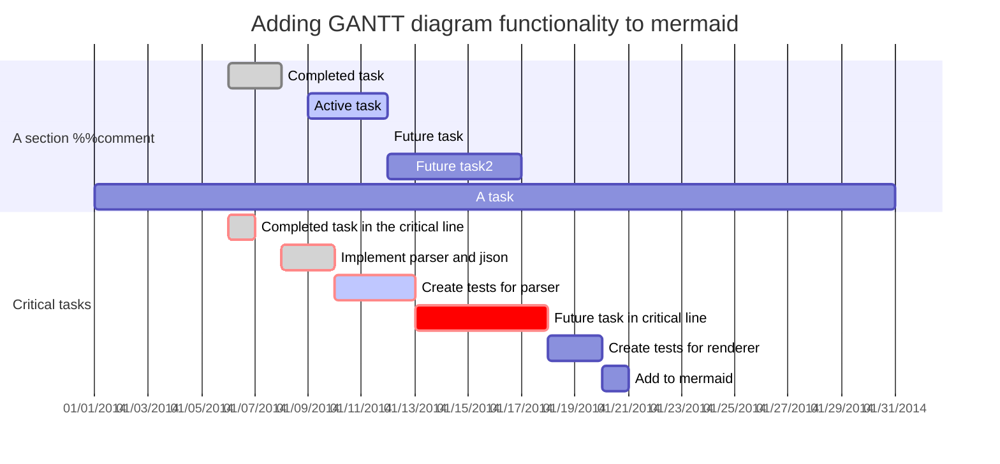
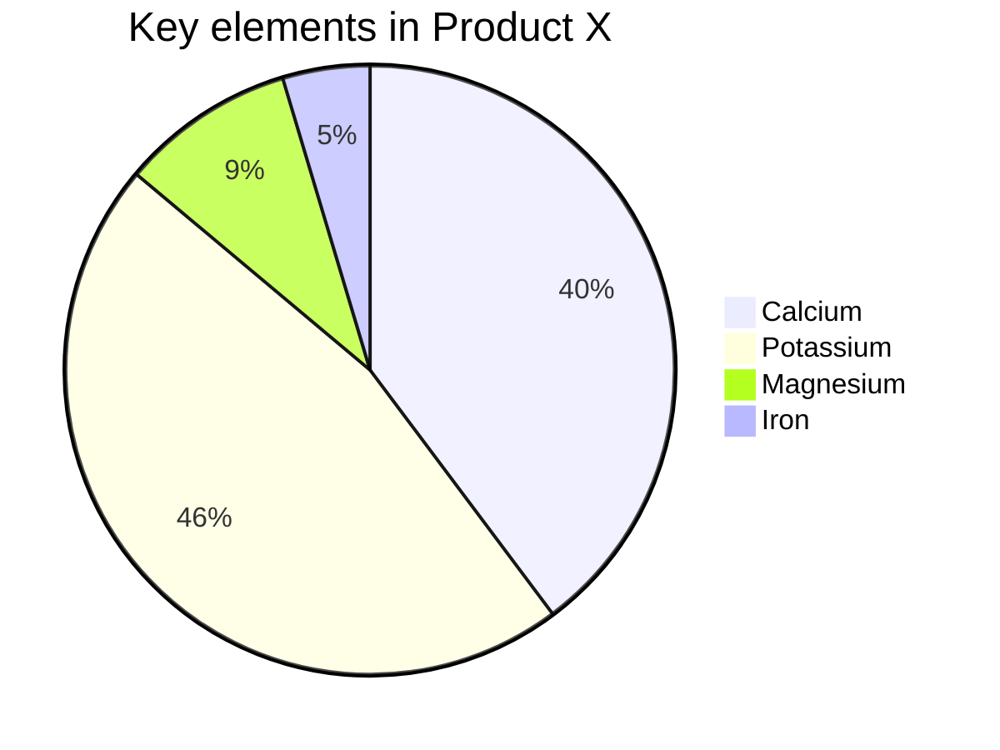
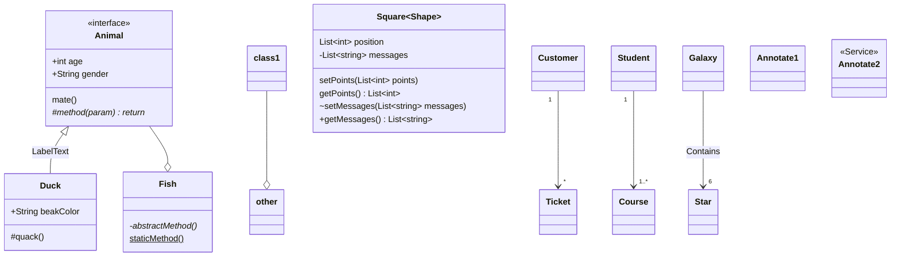
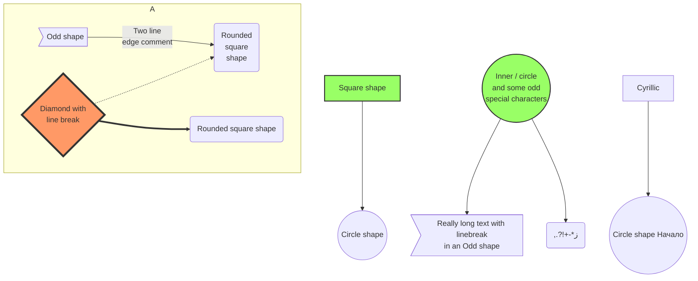
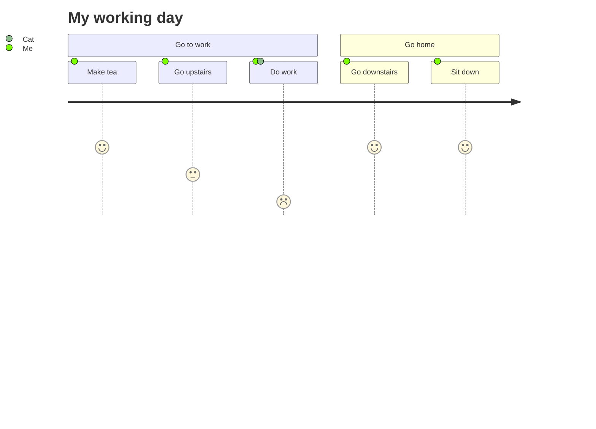

``` mermaid
stateDiagram %%comment
  s1
  state "Description with parenthesis" as s2
  s3 : Description with colon

  s1 --> s2
  s2 --> s3: Colon transition
  [*] --> s1 : Transition text
  s3 --> [*]

  state NestedComposite {
      [*] --> Nested

      state Nested {
          [*] --> second
      }
  }

  %% comment here
  state fork_state <<fork>>
      [*] --> fork_state
      fork_state --> State2

      state join_state <<join>>
      State2 --> join_state

  note right of State1
    Important information! You can write
    notes.
  end note
  note left of State2 : This is the note to the left.

  %% concurrency
  state Active {
      [*] --> NumLockOff
      NumLockOff --> NumLockOn : EvNumLockPressed
      NumLockOn --> NumLockOff : EvNumLockPressed
      --
      [*] --> CapsLockOff
      CapsLockOff --> CapsLockOn : EvCapsLockPressed
      CapsLockOn --> CapsLockOff : EvCapsLockPressed
  }
```




``` mermaid
graph TB %% comments
  %% Entity[Text]
  ID-1[Node 1]
  ID-2>Node 2]
  ID-3(Node 3 <br> text)
  %% Entity--Entity
  ID-1---ID-2
  ID-1 --> ID-3
  %% Entity--Text--Entity
  ID-2--Link between 2 and 3---ID-3
  ID-3-->|Action from 3 to 1|ID-1
  ID-3 -- "Action from 3 to 2. p/w: '_-!#$%^&*+=?,\'" --> ID-2
  %% Complex cases
  A[Hard edge] -->|Link text| B(Round edge)
  ID-1---ID-2(Text)
  B --> C{Text}
  C -->|One| D[Text]
  A(A) --> B(B)
  C[/C/] --> D>D]
  %% class/classDef
  classDef blue fill:#08f,stroke:#fff;
  class ID-1 blue
  class ID-1,ID-2 red
  %% click
  click ID-1 "https://github.com" "Tooltip text" %% comments
  click ID-2 alert "Tooltip for a callback"
  %% subgraph
  subgraph A subgraph
    ID-4{Node 4}
    ID-5((fa:fa-spinner))
    ID-6["Node 6 (same #quot;shape#quot;)"]
    ID-4-.->ID-5
    ID-5 -. Action from 5 to 4 .-> ID-4
    ID-5==>ID-6
    ID-6 == Action from 6 to 5 ==> ID-5
  end
```










